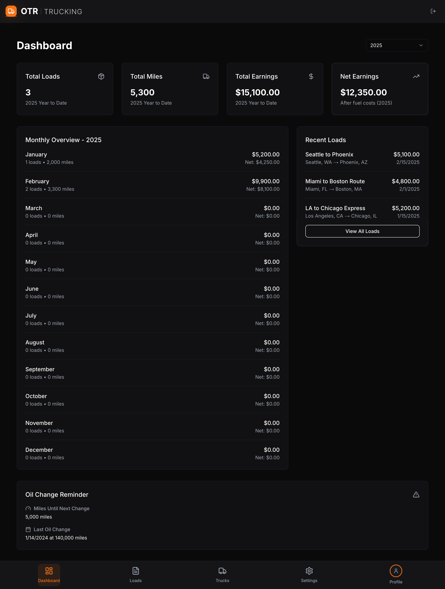
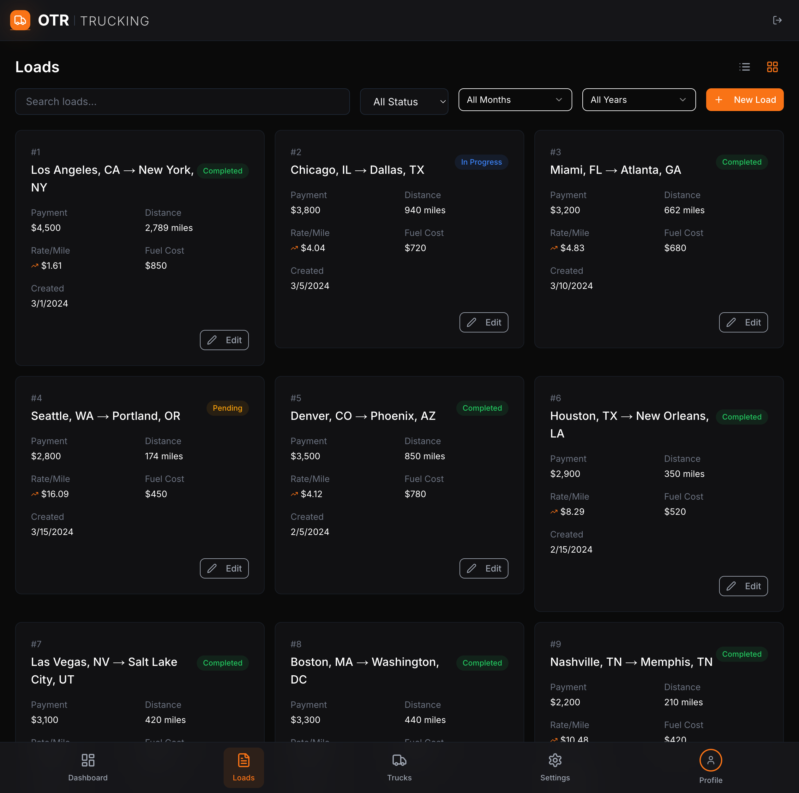
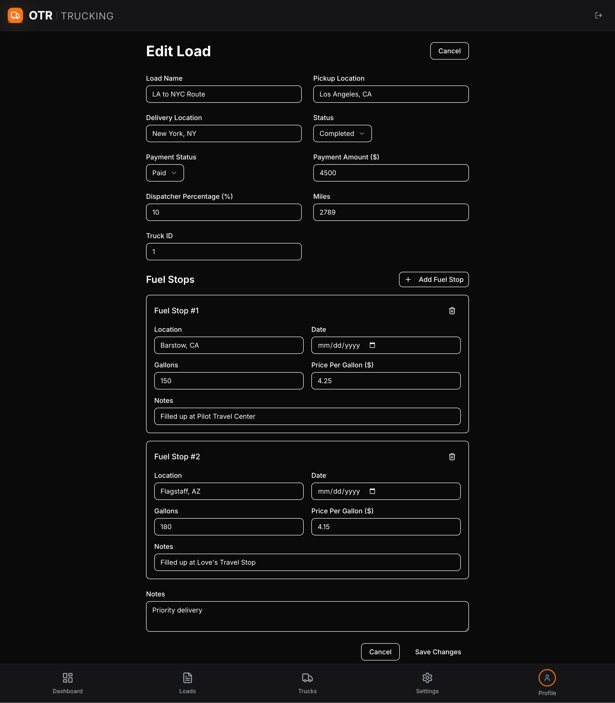
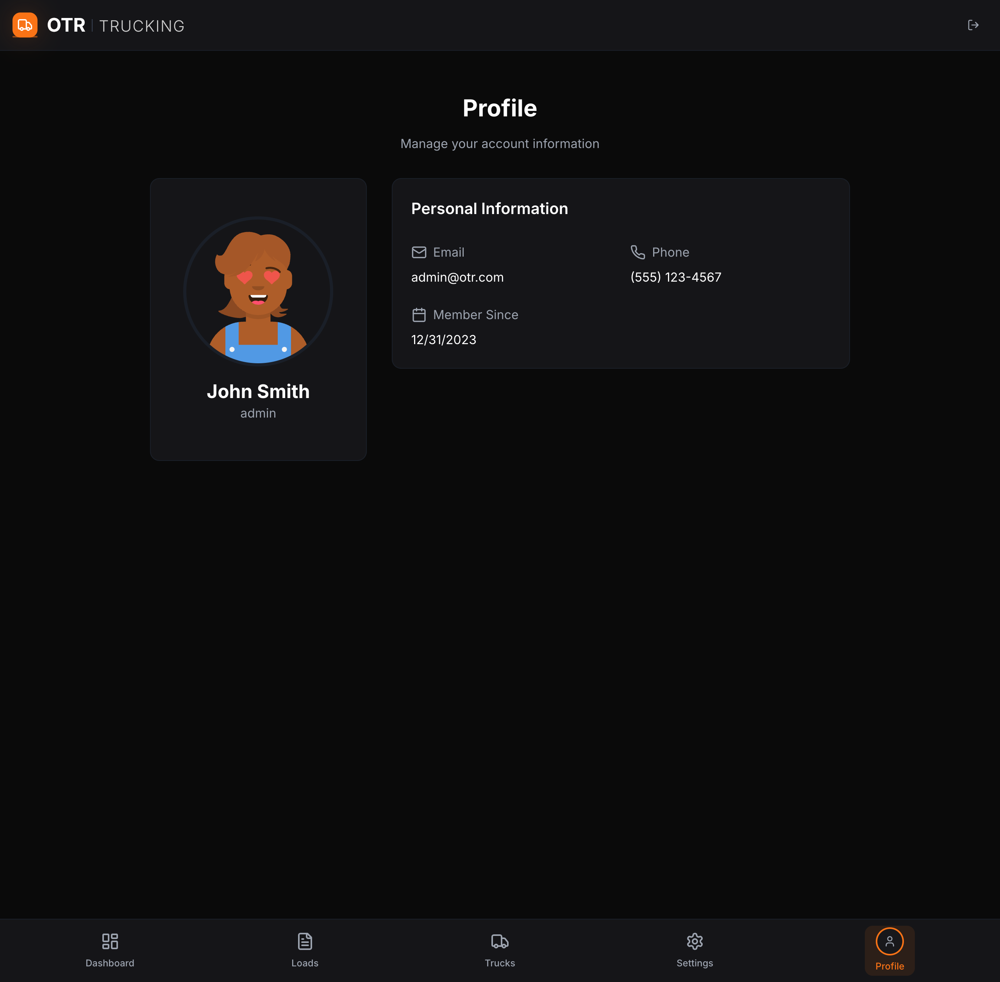

# OTR Trucking App



## Overview

OTR Trucking App is a comprehensive fleet management solution designed specifically for over-the-road trucking companies. The application streamlines operations, improves efficiency, and provides real-time insights into your fleet's performance.

## Features

### 🚛 Fleet Management
- **Truck Tracking**: Monitor your entire fleet in real-time
- **Load Management**: Assign and track loads across your fleet
- **Driver Profiles**: Maintain detailed driver information and performance metrics

### 📊 Analytics & Reporting
- **Financial Dashboard**: Track revenue, expenses, and profitability
- **Performance Metrics**: Monitor fuel efficiency, on-time delivery rates, and more
- **Year-over-Year Comparisons**: Analyze trends and make data-driven decisions

### 🔧 Maintenance & Compliance
- **Automated Fuel Receipt Scanning**: Upload receipts and let AI extract data automatically
- **Mileage & Oil Change Reminders**: Never miss maintenance with smart alerts
- **Paperwork Organizer**: Store and organize all your documents digitally

### 💰 Financial Tools
- **Dispatcher Cut Calculator**: Calculate dispatcher fees instantly
- **Expense Tracking**: Monitor and categorize all fleet-related expenses
- **Invoice Management**: Generate and track invoices for clients

## Screenshots

### Dashboard


### Load Management


### Analytics


## Technologies Used

### Frontend
- **Next.js 14**: React framework with server-side rendering
- **TypeScript**: Type-safe JavaScript
- **Tailwind CSS**: Utility-first CSS framework
- **Framer Motion**: Animation library
- **React Hook Form**: Form validation
- **Zod**: Schema validation
- **Recharts**: Charting library

### UI Components
- **Radix UI**: Unstyled, accessible components
- **Lucide React**: Icon library
- **Sonner**: Toast notifications

### Authentication
- **Custom Auth Solution**: Secure authentication with mobile compatibility
- **Native Browser Cookies**: Reliable cookie management across all devices

## Getting Started

### Prerequisites
- Node.js 18.x or higher
- npm or yarn

### Installation

1. Clone the repository
```bash
git clone https://github.com/yourusername/otr-trucking-app.git
cd otr-trucking-app
```

2. Install dependencies
```bash
npm install
# or
yarn install
```

3. Run the development server
```bash
npm run dev
# or
yarn dev
```

4. Open [http://localhost:3000](http://localhost:3000) with your browser to see the result.

## Mobile Login Solution

The application includes a robust mobile login solution that works reliably across all devices, including mobile phones and iPads. Here's what makes it work:

### Key Features

- **Native Browser Cookies**: Uses native browser cookie functions instead of third-party libraries for better mobile compatibility
- **Simplified Authentication Flow**: Streamlined login process with minimal complexity
- **Consistent Cookie Management**: Uses a consistent approach for setting and retrieving cookies
- **Mobile-Friendly Form Handling**: Optimized form submission for touch devices
- **Improved Error Handling**: Better error messages and state management

### Implementation Details

The mobile login solution includes:

1. Custom cookie helper functions (`setCookie`, `getCookie`, `deleteCookie`)
2. Middleware that checks for multiple cookie formats
3. Simplified login form with proper touch event handling
4. Consistent authentication state management

This approach ensures reliable authentication across all devices and browsers, with special attention to mobile compatibility.

## License

This project is licensed under the MIT License - see the LICENSE file for details.

## Acknowledgments

- Icons provided by [Lucide](https://lucide.dev/)
- UI components inspired by [shadcn/ui](https://ui.shadcn.com/)
- Mock data generated for demonstration purposes
